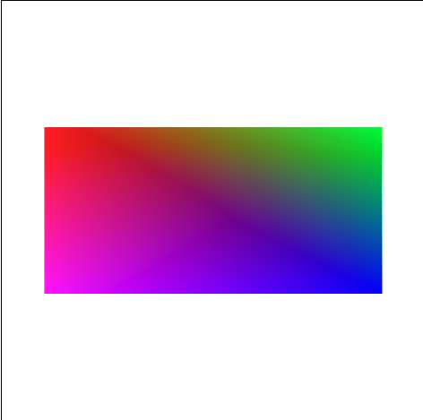

# WebGL Square Example

This is a very simple WebGL program that renders a colored square using two triangles.

## Includes:
- Vertex and frament shaders written in GLSL
- Per vertex coloring
- Basic transformation matrix setup

## Author
Based on coursework from CS4600, University of Utah
